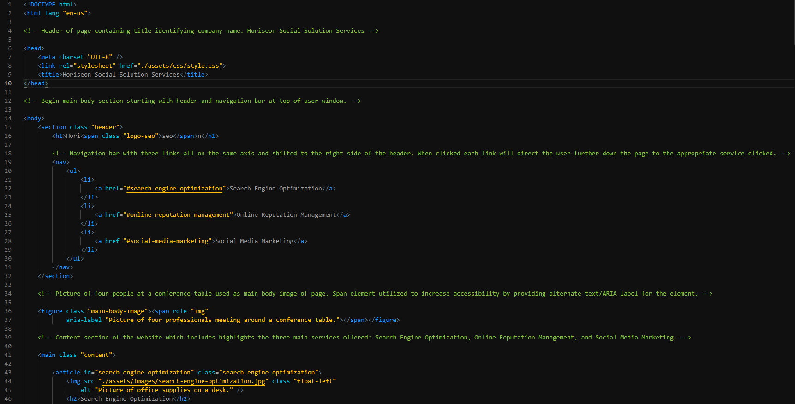
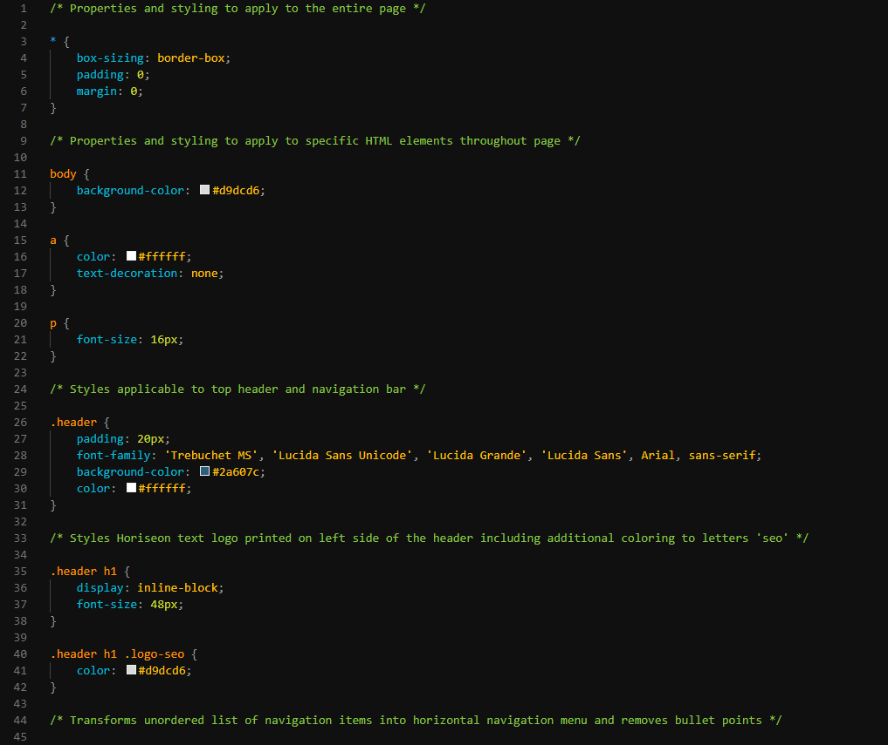

# msu-code-refactor-hw
## MSU Coding Bootcamp Code Refactor Homework
### by Michael Bussert
### GitHub: [mbussert](https://github.com/mbussert) | Email: mbussert@gmail.com 

## Changes:
---------------------------------
Both index.html and style.css documents were refactored to increase accessibility for users and developers. Semantic tags, along with alternate text for images, were introduced to index.html to provide additional clarity and description. The style.css document was trimmed of excess, condensed, and reorganized for better clarity as well. Both documents were thoroughly commented in addition.

View the Updated Page with Refactored Code Here: [Click Here](https://mbussert.github.io/msu-code-refactor-hw/Develop/index.html) 

----------------------------------------
### Screenshot Examples of Changes Made for Accessibility

### index.html:

### style.css:

